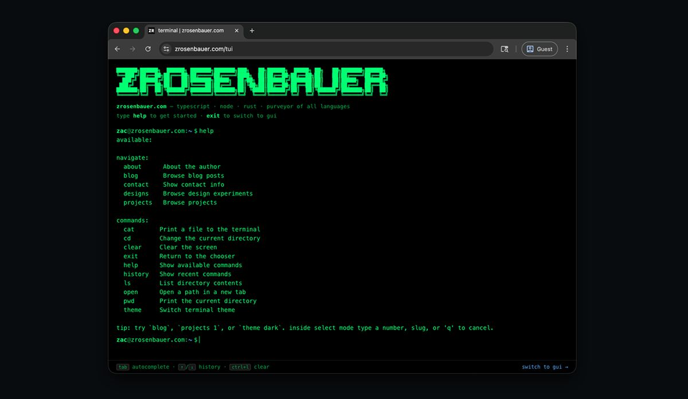

<div align="center">
  
  <p><strong>Personal site & blog for Zac Rosenbauer. Statically exported Next.js with a GUI and a TUI over the same MDX content.</strong></p>

<a href="https://zrosenbauer.com"></a>
<a href="https://github.com/zrosenbauer/zrosenbauer.com/actions/workflows/ci.yml"></a>
<a href="https://github.com/zrosenbauer/zrosenbauer.com/actions/workflows/deploy.yml"></a>
<a href="./LICENSE"></a>

</div>

## Layout

Two front ends, same MDX content:

- `/gui` — the graphical web UI
- `/tui` — a terminal-style alt UI

Content lives in `content/` (blog posts, projects, designs, pages). Routes in `src/app/`. Tailwind v4, contentlayer, shadcn primitives, oxlint + oxfmt.

## Scripts

```bash
pnpm dev           # local dev server
pnpm build         # contentlayer + static export to out/
pnpm preview       # build + serve out/
pnpm typecheck     # contentlayer + tsc
pnpm lint          # oxlint
pnpm format        # oxfmt
pnpm lint:content  # alex (inclusivity + profanity over MDX)
```

## License

- **Code, configuration, tooling** — MIT, see [`LICENSE`](./LICENSE).
- **Content** (posts, designs, project entries, page copy, prose, imagery in `public/img/`) — All Rights Reserved, see [`content/LICENSE`](./content/LICENSE).

For permission to reuse content beyond fair use, [me@zrosenbauer.com](mailto:me@zrosenbauer.com).
